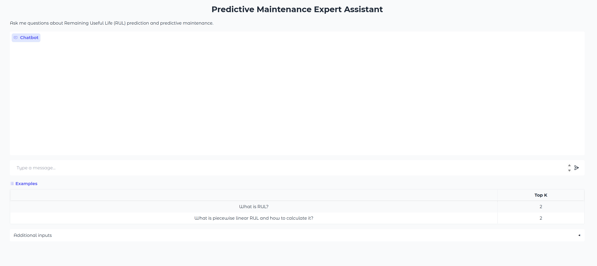
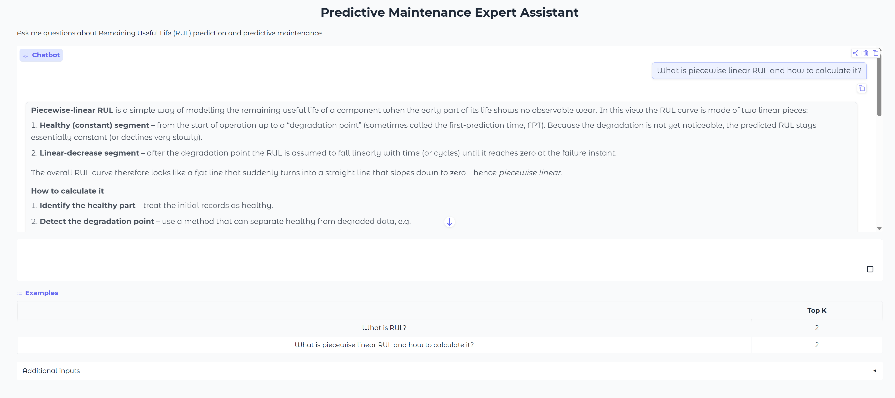

# Predictive Maintenance Expert Assistant: A RAG Chatbot for Remaining Useful Life (RUL) Prediction
 
## 🎯 Project Overview
 
Finding answers on Remaining Useful Life (RUL) prediction means digging through many long papers. This project is a **Retrieval-Augmented Generation (RAG) chatbot** that reads a curated library of predictive maintenance research and answers questions directly, grounded in those sources rather than the LLM's general knowledge. Built with LlamaIndex, Groq, and a Gradio web interface, running entirely in Google Colab.

## 📊 Dataset & Sources
 
The knowledge base is a curated set of **8 academic papers**, review articles, and industry reports on predictive maintenance and Remaining Useful Life (RUL) prediction, selected to cover the field from foundational surveys to recent (post-2023) deep-learning approaches. PDF/TXT files are stored on Google Drive and loaded via LlamaIndex's `SimpleDirectoryReader`; each PDF page becomes a separate `Document`, tagged with filename and page-number metadata for traceability.
 
**Sources used:**
 
1. Ucar, A., Karakose, M., & Kırımça, N. (2024). *Artificial Intelligence for Predictive Maintenance Applications: Key Components, Trustworthiness, and Future Trends.* Applied Sciences, 14(2), 898. https://doi.org/10.3390/app14020898
2. Carvalho, T. P., Soares, F. A. A. M. N., Vita, R., Francisco, R. P., Basto, J. P., & Alcalá, S. G. S. (2019). *A systematic literature review of machine learning methods applied to predictive maintenance.* Computers & Industrial Engineering.
3. Zhu, T., Ran, Y., Zhou, X., & Wen, Y. (2024). *A Survey of Predictive Maintenance: Systems, Purposes and Approaches.* arXiv:1912.07383. https://arxiv.org/abs/1912.07383
4. Hector, I., & Panjanathan, R. (2024). *Predictive maintenance in Industry 4.0: a survey of planning models and machine learning techniques.* PeerJ Computer Science, 10:e2016. https://doi.org/10.7717/peerj-cs.2016
5. PwC & Mainnovation. (2017, June). *Predictive Maintenance 4.0: Predict the unpredictable.* [Industry report]
6. Meitz, L., Senge, J., Wagenhals, T., Schöler, T., Hähner, J., Edinger, J., & Krupitzer, C. (2025). *A Literature Review Framework and Open Research Challenges for Predictive Maintenance in industry 4.0.* Computers & Industrial Engineering, 206, 111193. https://doi.org/10.1016/j.cie.2025.111193
7. Amin, A. A., Mubarak, A., Waseem, S., Alqarni, Z. A., & Manzoor, H. U. (2026). *Remaining Useful Life (RUL) Prediction Methods for Machine Health Estimation and Fault Diagnosis: A Comprehensive Review of Latest Techniques and Future Prospects.* Engineering Reports, 8:e70699. https://doi.org/10.1002/eng2.70699
8. Wu, F., Wu, Q., Tan, Y., & Xu, X. (2024). *Remaining Useful Life Prediction Based on Deep Learning: A Survey.* Sensors, 24(11), 3454. https://doi.org/10.3390/s24113454

**Dataset used for domain scope (referenced within the literature, not directly ingested):** NASA C-MAPSS turbofan degradation dataset [https://data.nasa.gov/dataset/cmapss-jet-engine-simulated-data].

## 🚀 Key Findings & Results
 
* **Diagnosed and fixed a subtle retrieval-vs-generation failure mode:** for a known-hard question, the correct source chunk was being retrieved (even ranked #1 by similarity), yet the LLM still failed to use it correctly. Isolating data presence, retrieval ranking, memory state, and generation as separate hypotheses showed the root cause was in generation, not retrieval — fixed via **system-prompt engineering** rather than more aggressive retrieval tuning.
* **Balanced faithfulness against usefulness:** `temperature=0` produced answers that were accurate but overly terse and copy-pasted; raising it to `0.2` (with `similarity_top_k` tuned from 4 to 6) restored complete, well-explained answers without introducing hallucination.
* **Solved multi-user state leakage:** the basic Gradio interface shares one chat-engine memory across every visitor. The advanced interface resets and refills that memory from each browser session's own history on every message, so concurrent users never see each other's conversations — with retrieval depth (Top-K) live-adjustable per session.


## 🛠️ Technologies Used
 
 
**Programming:** 
Python
 
**RAG Framework:**
LlamaIndex (`llama-index-core`, `llama-index-llms-groq`, `llama-index-readers-file`, `llama-index-embeddings-huggingface`)
 
**LLM Inference:**
Groq API (`openai/gpt-oss-120b`)
 
**Embeddings:**
HuggingFace `BAAI/bge-base-en-v1.5`
 
**Web Interface:**
Gradio 6.x
 
**Environment & Storage:**
Google Colab, Google Drive 

## 📁  Project Structure
 
```
├── rag_chatbot.ipynb   # Main notebook: full RAG pipeline + Gradio UI
├── images/                   
└── README.md
```
 
## 📈 Visualisations

*The advanced Gradio interface before a question is asked — note the per-example Top-K values and the live-adjustable Top-K slider under "Additional inputs".*
 

*The same interface answering "What is piecewise linear RUL and how to calculate it?" — grounded in the retrieved PdM/RUL literature rather than the LLM's general knowledge.*

## 🔗 How to Use This Project
 
1. **Main Analysis:** Open [`rag_chatbot_github.ipynb`](rag_chatbot_github.ipynb) in Google Colab.
2. **Data:** Upload your own PDF/TXT predictive-maintenance documents to a Google Drive folder (see [Dataset & Sources](#dataset--sources) for the papers used in this project).
3. **Setup:** Add your `GROQ_API_KEY` and `HF_TOKEN` to Colab's Secrets manager (key icon in the left sidebar)
4. **Configure paths:** In Sections 5, 8, and 9 of the notebook, update `DATA_DIR` and `INDEX_DIR` to point at your own Drive folders.
5. **Run the Code:** Run all cells in order. On the first run, execute Section 8 to build and persist the index; on later runs, skip straight to Section 9 to reload it instead.
6. **Launch the chatbot:** Run Section 13 (basic single-user demo) or Section 14 (multi-user-safe version with an adjustable Top-K slider).

